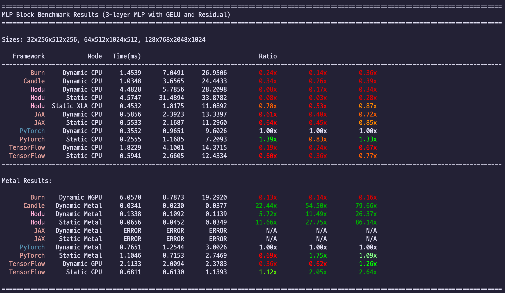
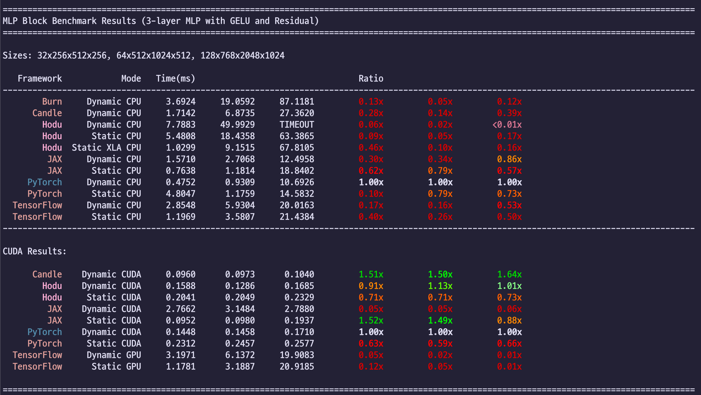

# Benchmarks

Performance benchmarks comparing Hodu against popular deep learning frameworks.

## MLP Benchmark Results

### Configuration 1: MacBook Air M2
- **Hardware**: MacBook Air M2 (16GB RAM)
- **Device**: CPU, Metal
- **Compiler**: HODU, XLA
- **Version**: v0.2.2



---

### Configuration 2: Cloud GPU Instance
- **Hardware**:
  - GPU: 24GB VRAM (896.5 GB/s bandwidth, 81.8 TFLOPS)
  - CPU: AMD EPYC 7742 64-Core Processor (32/256 cores, 129.0 GB RAM)
  - Storage: KINGSTON SFYRD4000G (5974.0 MB/s, 32GB)
  - Motherboard: ROME2D32GM-2T (PCIe 4.0 x16, 21.4 GB/s)
- **Device**: CPU, CUDA
- **Compiler**: HODU, XLA
- **CUDA Version**: Max 12.6
- **Version**: v0.2.2



## Requirements

- **Python**: 3.11.x
- **Rust**: 1.90.0 or higher

## Setup

```bash
# Install Python dependencies for plotting
pip3 install -r requirements.txt

# Setup benchmark environments (JAX, TensorFlow, PyTorch, etc.)
# For CPU-only or macOS (Metal):
python3 setup.py

# For CUDA 12 support (includes JAX with CUDA 12):
python3 setup.py --cuda12

# For CUDA 13 support (includes JAX with CUDA 13):
python3 setup.py --cuda13
```

**Note**:
- On macOS, JAX with Metal support is installed automatically
- On Linux, use `--cuda12` or `--cuda13` to enable JAX CUDA support for GPU benchmarks
- Without CUDA flags, only CPU-only JAX will be installed on Linux

## Running Benchmarks

Run benchmarks from the `benchmarks` directory using:

```bash
# Run matrix multiplication benchmark
python3 run.py --bench=matmul --cpu            # CPU only
python3 run.py --bench=matmul --metal          # Metal only (macOS)
python3 run.py --bench=matmul --cuda           # CUDA only (NVIDIA GPUs)
python3 run.py --bench=matmul --cpu --metal    # CPU + Metal (macOS)
python3 run.py --bench=matmul --cpu --xla      # CPU + XLA

# Run MLP block benchmark
python3 run.py --bench=mlp --cpu               # CPU only
python3 run.py --bench=mlp --metal             # Metal only (macOS)
python3 run.py --bench=mlp --cuda              # CUDA only (NVIDIA GPUs)
python3 run.py --bench=mlp --cpu --metal       # CPU + Metal (macOS)
python3 run.py --bench=mlp --cpu --xla         # CPU + XLA

# Quiet mode (progress bar only)
python3 run.py --bench=matmul --cpu --quiet

# Save results as JSON
python3 run.py --bench=matmul --cpu --metal --save

# Save results and generate plots
python3 run.py --bench=matmul --cpu --metal --save --plot

# Plot from existing JSON results
python3 run.py --plot=results_matmul_20231029_143000.json
```

### Available Benchmarks

- **matmul**: Matrix multiplication (3D: MxKxN)
- **mlp**: MLP Block (3-layer MLP with GELU and Residual, 4D: BxIxHxO)

### Options

- `--cpu`: Run CPU benchmarks
- `--metal`: Run Metal (macOS GPU) benchmarks
- `--cuda`: Run CUDA (NVIDIA GPU) benchmarks
- `--xla`: Run XLA benchmarks (requires `--cpu`)
- `--quiet`: Show only progress bar
- `--save`: Save results to JSON file
- `--plot`: Generate visualization (requires `--save`)
- `--plot=<file>`: Generate plot from existing JSON file

### Visualization

The `--plot` flag generates professional benchmark graphs with:
- **Speedup ratio** visualization (baseline = PyTorch Dynamic)
- Baseline reference line at 1.0x
- Bar chart for easy comparison across frameworks
- Framework-specific color coding (Hodu in pink, PyTorch in orange, etc.)
- Dynamic vs Static execution modes differentiation (solid vs hatched bars)
- Separate CPU and GPU subplots
- Log-scale Y-axis for clear performance differences
- High-resolution PNG output (300 DPI)
