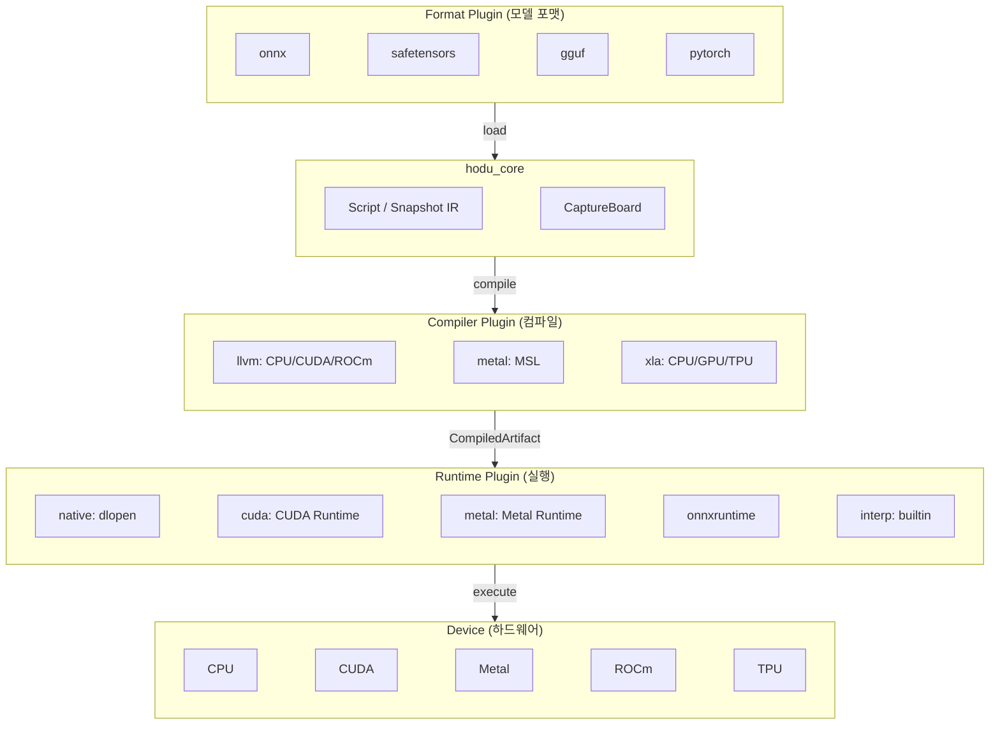
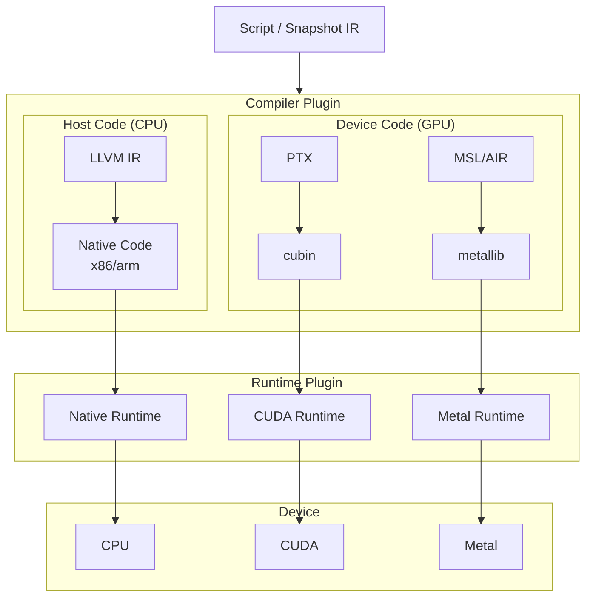
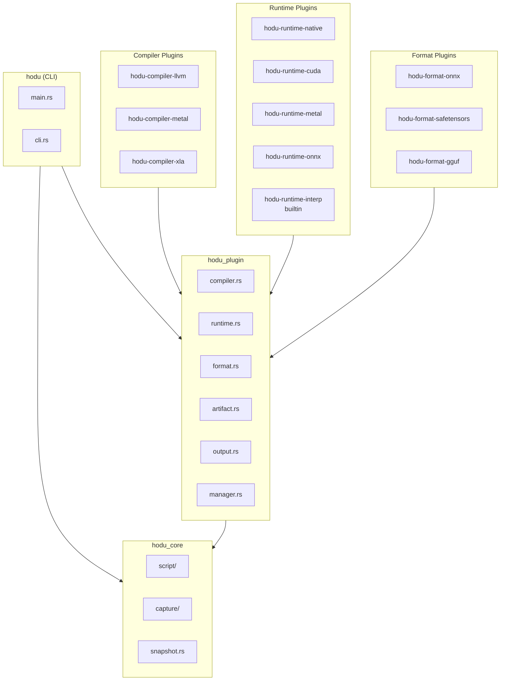
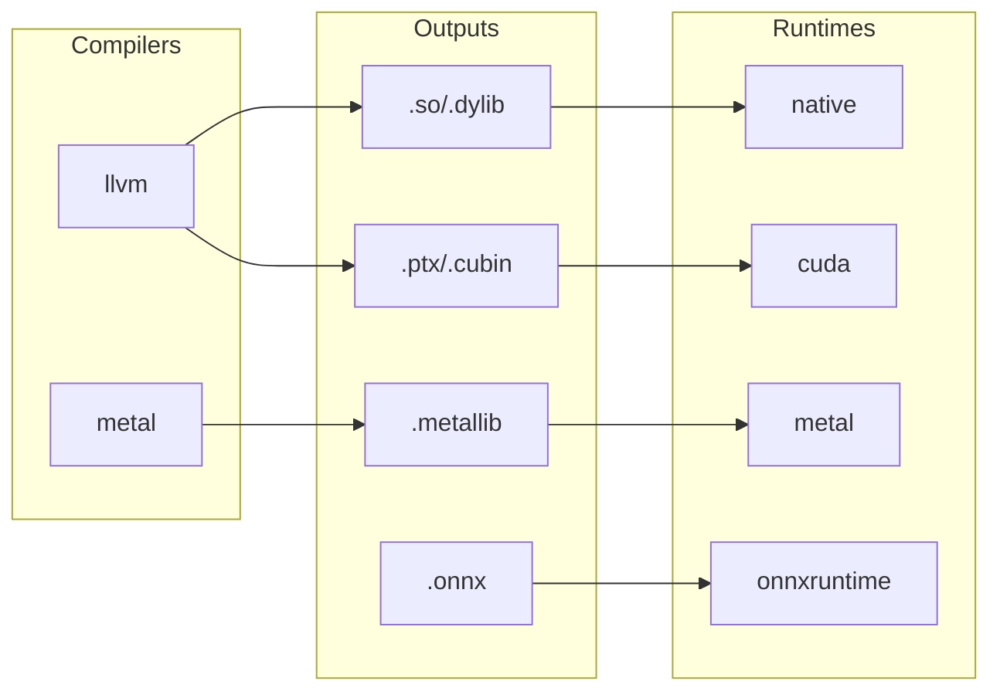

# Hodu 0.3.0-2 TODO

## 플러그인 아키텍처 설계

### 목표

hodu_core를 순수 IR 생성(Script/Snapshot)까지만 유지하고, 컴파일/실행은 플러그인 시스템으로 분리하여 동적 로딩 가능하게 함.

### 아키텍처 개요



### 컴파일 체인 (GPU)



### Device별 IR 및 출력 포맷

| Device | IR | 출력 포맷 옵션 |
|--------|-----|---------------|
| CPU | LLVM IR | `.o`, `.so`/`.dylib`/`.dll`, `.a`/`.lib`, 실행파일, `.ll`, `.bc`, `.s` |
| CUDA | PTX / LLVM NVPTX | `.ptx`, `.cubin`, `.fatbin` |
| Metal | MSL → AIR | `.metal`, `.air`, `.metallib` |
| ROCm | LLVM AMDGPU | `.s`, `.hsaco` |
| Vulkan/OpenCL | SPIR-V | `.spv` |

---

## 플러그인 타입

### 1. Format Plugin

모델 포맷 로드/저장 담당.

```rust
pub trait FormatPlugin: Send + Sync {
    fn name(&self) -> &str;
    fn version(&self) -> &str;
    fn extensions(&self) -> &[&str];

    fn load(&self, path: &Path) -> HoduResult<Script>;
    fn save(&self, script: &Script, path: &Path) -> HoduResult<()>;
    fn can_save(&self) -> bool;
}
```

**예시 플러그인:**
- `hodu-format-onnx`: `.onnx` 파일 로드/저장
- `hodu-format-safetensors`: `.safetensors` 파일 로드
- `hodu-format-gguf`: `.gguf` 파일 로드 (llama.cpp 호환)
- `hodu-format-pytorch`: `.pt`, `.pth` 파일 로드

### 2. Compiler Plugin

Script → CompiledArtifact 변환 담당.

```rust
pub trait CompilerPlugin: Send + Sync {
    fn name(&self) -> &str;
    fn version(&self) -> &str;
    fn supported_devices(&self) -> Vec<Device>;
    fn supported_formats(&self, device: Device) -> Vec<OutputFormat>;

    /// JIT 컴파일 (메모리에 로드)
    fn compile(&self, script: &Script, device: Device) -> HoduResult<CompiledArtifact>;

    /// AOT 빌드 (파일로 출력)
    fn build(
        &self,
        script: &Script,
        device: Device,
        format: OutputFormat,
        path: &Path,
    ) -> HoduResult<()>;
}
```

**예시 플러그인:**
- `hodu-compiler-llvm`: CPU/CUDA/ROCm 지원 (LLVM 기반)
- `hodu-compiler-metal`: Metal 지원 (MSL 생성)
- `hodu-compiler-xla`: XLA 컴파일러

### 3. Runtime Plugin

CompiledArtifact 로드 및 실행 담당.

```rust
pub trait RuntimePlugin: Send + Sync {
    fn name(&self) -> &str;
    fn version(&self) -> &str;
    fn supported_devices(&self) -> Vec<Device>;
    fn loadable_formats(&self, device: Device) -> Vec<OutputFormat>;

    /// 메모리에서 로드
    fn load(&self, artifact: &CompiledArtifact, device: Device) -> HoduResult<ExecutableModule>;

    /// 파일에서 로드
    fn load_file(&self, path: &Path, device: Device) -> HoduResult<ExecutableModule>;
}

pub struct ExecutableModule { ... }

impl ExecutableModule {
    fn execute(&self, inputs: &[(&str, &Tensor)]) -> HoduResult<HashMap<String, Tensor>>;
}
```

**예시 플러그인:**
- `hodu-runtime-native`: CPU 네이티브 (.so/.dylib 로드)
- `hodu-runtime-cuda`: CUDA Runtime (.ptx/.cubin 로드)
- `hodu-runtime-metal`: Metal Runtime (.metallib 로드)
- `hodu-runtime-onnx`: ONNX Runtime
- `hodu-runtime-interp`: 순수 인터프리터 (builtin)

---

## CompiledArtifact

Compiler와 Runtime 간 교환 타입.

```rust
pub struct CompiledArtifact {
    pub format: OutputFormat,
    pub device: Device,
    pub data: Vec<u8>,
    pub inputs: Vec<ArtifactTensorInfo>,
    pub outputs: Vec<ArtifactTensorInfo>,
    pub symbols: Option<ArtifactSymbols>,
}

pub struct ArtifactTensorInfo {
    pub name: String,
    pub shape: Vec<usize>,
    pub dtype: ArtifactDType,
}

/// ABI 안정성을 위해 hodu_core::DType과 독립적으로 정의
pub enum ArtifactDType {
    Bool, F8E4M3, F8E5M2, BF16, F16, F32, F64,
    U8, U16, U32, U64, I8, I16, I32, I64,
}
```

---

## 출력 포맷 정의

```rust
#[derive(Debug, Clone, Copy, PartialEq, Eq)]
#[repr(C)]
pub enum OutputFormat {
    // === CPU (Native) ===
    Object,           // .o
    SharedLib,        // .so / .dylib / .dll
    StaticLib,        // .a / .lib
    Executable,       // 실행파일

    // === LLVM IR (디버깅용) ===
    LlvmIR,           // .ll (텍스트)
    LlvmBitcode,      // .bc (바이너리)
    Assembly,         // .s

    // === CUDA ===
    Ptx,              // .ptx (텍스트 IR)
    Cubin,            // .cubin (단일 아키텍처 바이너리)
    Fatbin,           // .fatbin (멀티 아키텍처)

    // === Metal ===
    Msl,              // .metal (소스 코드)
    Air,              // .air (IR)
    Metallib,         // .metallib (바이너리)

    // === ROCm ===
    Hsaco,            // .hsaco (AMD GPU 바이너리)

    // === Portable ===
    SpirV,            // .spv (Vulkan/OpenCL)
}
```

---

## 플러그인 시스템 구현

### 디렉토리 구조

```
~/.hodu/
├── plugins/
│   ├── hodu-compiler-llvm.dylib
│   ├── hodu-runtime-cuda.dylib
│   ├── hodu-format-onnx.dylib
│   └── ...
├── config.toml
└── cache/
```

### 플러그인 로더

```rust
pub struct PluginManager {
    compilers: HashMap<String, LoadedCompiler>,
    runtimes: HashMap<String, LoadedRuntime>,
    formats: HashMap<String, LoadedFormat>,
    plugin_dir: PathBuf,
}

impl PluginManager {
    pub fn new(plugin_dir: impl Into<PathBuf>) -> Self;
    pub fn with_default_dir() -> HoduResult<Self>;  // ~/.hodu/plugins

    // 동적 로딩
    pub fn load_compiler(&mut self, path: impl AsRef<Path>) -> HoduResult<()>;
    pub fn load_runtime(&mut self, path: impl AsRef<Path>) -> HoduResult<()>;
    pub fn load_format(&mut self, path: impl AsRef<Path>) -> HoduResult<()>;
    pub fn load_all(&mut self) -> HoduResult<()>;

    // Builtin 등록
    pub fn register_compiler(&mut self, plugin: Box<dyn CompilerPlugin>);
    pub fn register_runtime(&mut self, plugin: Box<dyn RuntimePlugin>);
    pub fn register_format(&mut self, plugin: Box<dyn FormatPlugin>);

    // 조회
    pub fn compiler(&self, name: &str) -> Option<&dyn CompilerPlugin>;
    pub fn runtime(&self, name: &str) -> Option<&dyn RuntimePlugin>;
    pub fn format(&self, name: &str) -> Option<&dyn FormatPlugin>;
    pub fn format_for_extension(&self, ext: &str) -> Option<&dyn FormatPlugin>;
}
```

---

## CLI 명령어

### 플러그인 관리

```bash
# 설치된 플러그인 목록
hodu plugin list
> Compilers:
>   llvm        1.0.0  [cpu, cuda, rocm]
> Runtimes:
>   interp      1.0.0  [cpu]  (builtin)
>   native      1.0.0  [cpu]
>   cuda        1.0.0  [cuda]
> Formats:
>   hdss        1.0.0  [.hdss]  (builtin)
>   onnx        1.0.0  [.onnx]

# 플러그인 상세 정보
hodu plugin info llvm
> Compiler: llvm
> Version: 1.0.0
> Devices:
>   cpu   → [object, shared, static, executable, llvm-ir, llvm-bc, asm]
>   cuda  → [ptx, cubin, fatbin, llvm-ir]
>   rocm  → [hsaco, llvm-ir, asm]
```

### 모델 실행 (JIT)

```bash
# 기본 실행 (interp runtime)
hodu run model.hdss --input input.json

# Compiler + Runtime 지정
hodu run model.hdss --compiler llvm --runtime native --device cpu
hodu run model.hdss --compiler llvm --runtime cuda --device cuda:0

# 출력 저장
hodu run model.hdss --input input.json -o output.json
```

### AOT 빌드

```bash
# 공유 라이브러리
hodu build model.hdss -o libmodel.so --compiler llvm --device cpu

# CUDA PTX/cubin
hodu build model.hdss -o model.ptx --compiler llvm --device cuda
hodu build model.hdss -o model.cubin --compiler llvm --device cuda --format cubin

# Metal
hodu build model.hdss -o model.metallib --compiler metal --device metal
```

---

## Crate 구조



---

## 구현 계획

### Phase 1: Core 분리

- [x] hodu_core에서 script/compiled/ 제거
- [x] hodu_core는 Script/Snapshot/CaptureBoard만 유지

### Phase 2: Plugin API 설계

- [x] hodu_plugin crate 생성
- [x] CompilerPlugin trait 정의
- [x] RuntimePlugin trait 정의
- [x] FormatPlugin trait 정의
- [x] CompiledArtifact 타입 정의
- [x] OutputFormat enum 정의
- [x] PluginManager 구현

### Phase 3: Builtin 플러그인 구현

- [ ] hodu-runtime-interp (builtin, 순수 인터프리터)
- [ ] hdss format (builtin)

### Phase 4: Compiler 플러그인 구현

- [ ] hodu-compiler-llvm
  - [ ] CPU codegen
  - [ ] CUDA codegen (PTX)
  - [ ] ROCm codegen
- [ ] hodu-compiler-metal
  - [ ] MSL codegen

### Phase 5: Runtime 플러그인 구현

- [ ] hodu-runtime-native (dlopen)
- [ ] hodu-runtime-cuda
- [ ] hodu-runtime-metal

### Phase 6: Format 플러그인 구현

- [ ] hodu-format-onnx

### Phase 7: CLI 업데이트

- [ ] `hodu plugin` 서브커맨드
- [ ] `hodu run` 업데이트 (compiler/runtime 옵션)
- [ ] `hodu build` 업데이트

---

## 참고: Compiler/Runtime 지원 매트릭스

### Compiler 지원

| Compiler | CPU | CUDA | ROCm | Metal |
|----------|-----|------|------|-------|
| llvm | O | O | O | - |
| metal | - | - | - | O |
| xla | O | O | - | - |

### Runtime 지원

| Runtime | CPU | CUDA | Metal | 로드 가능 포맷 |
|---------|-----|------|-------|--------------|
| interp | O | - | - | (직접 실행) |
| native | O | - | - | .so/.dylib |
| cuda | - | O | - | .ptx/.cubin/.fatbin |
| metal | - | - | O | .metallib |
| onnxruntime | O | O | - | .onnx |

### Compiler → Runtime 조합


