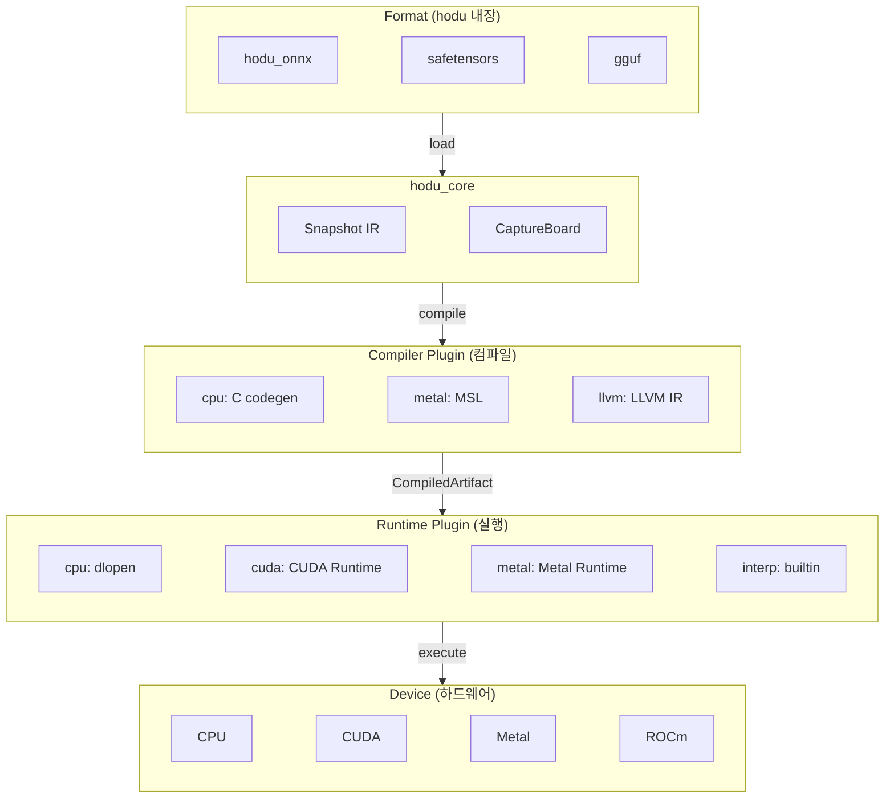
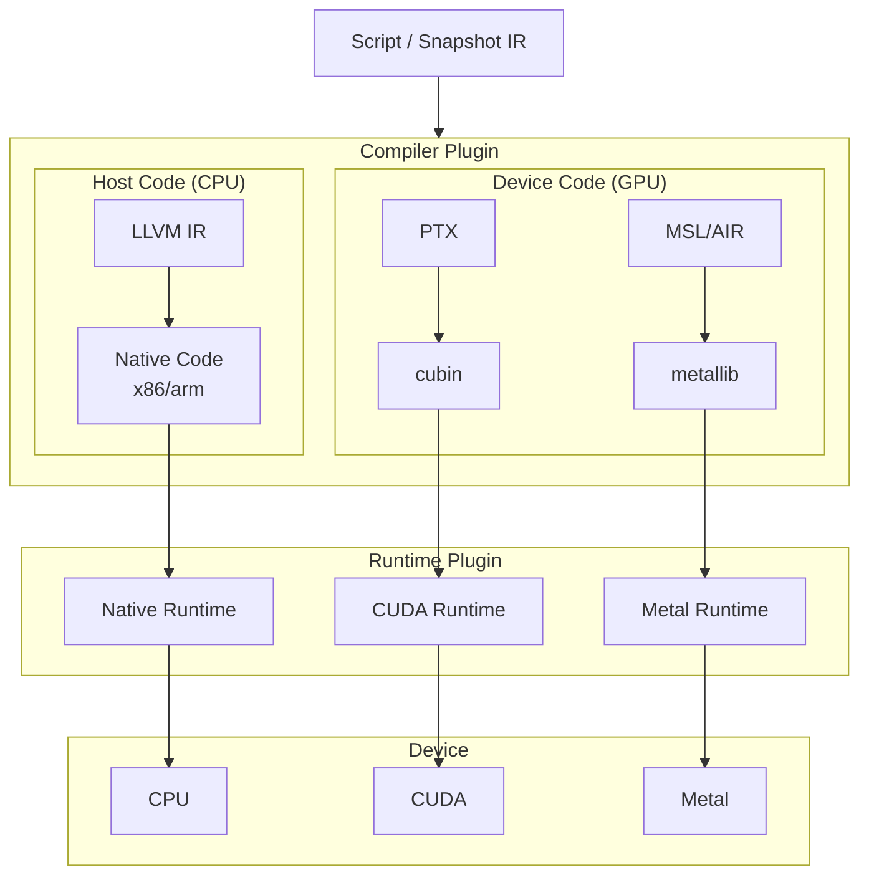
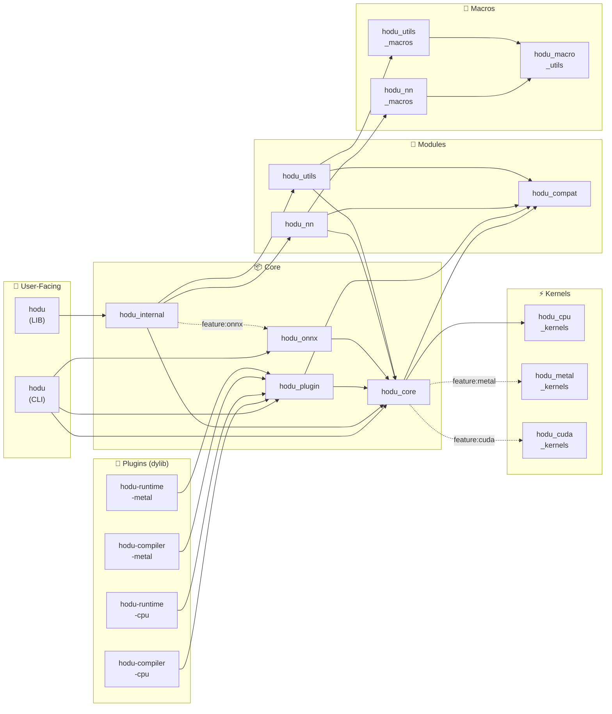
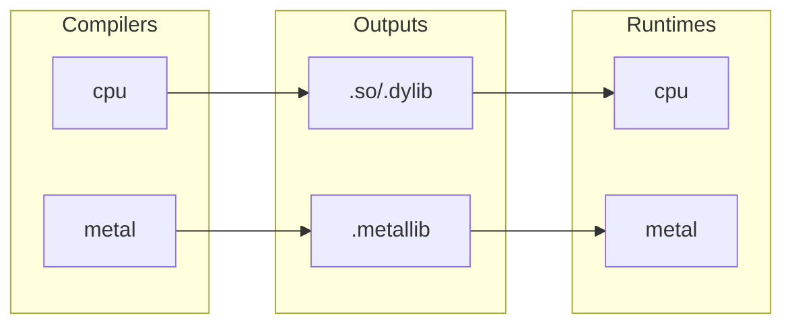

# Hodu 0.3.0-2 TODO

## 플러그인 아키텍처 설계

### 목표

hodu_core를 순수 IR 생성(Snapshot)까지만 유지하고, 컴파일/실행은 플러그인 시스템으로 분리하여 동적 로딩 가능하게 함.
모델 포맷 로드는 hodu 내부에서 직접 구현 (hodu_onnx 등).

### 아키텍처 개요



### 컴파일 체인 (GPU)



### Device별 IR 및 출력 포맷

| Device | IR | 출력 포맷 옵션 |
|--------|-----|---------------|
| CPU | LLVM IR | `.o`, `.so`/`.dylib`/`.dll`, `.a`/`.lib`, 실행파일, `.ll`, `.bc`, `.s` |
| CUDA | PTX / LLVM NVPTX | `.ptx`, `.cubin`, `.fatbin` |
| Metal | MSL → AIR | `.metal`, `.air`, `.metallib` |
| ROCm | LLVM AMDGPU | `.s`, `.hsaco` |
| Vulkan/OpenCL | SPIR-V | `.spv` |

---

## 플러그인 타입

### 1. Compiler Plugin

Snapshot → CompiledArtifact 변환 담당.

```rust
pub trait CompilerPlugin: Send + Sync {
    fn name(&self) -> &str;
    fn version(&self) -> &str;
    fn supported_devices(&self) -> Vec<Device>;
    fn supported_formats(&self, device: Device) -> Vec<OutputFormat>;

    /// JIT 컴파일 (메모리에 로드)
    fn compile(&self, snapshot: &Snapshot, device: Device) -> HoduResult<CompiledArtifact>;

    /// AOT 빌드 (파일로 출력)
    fn build(
        &self,
        snapshot: &Snapshot,
        device: Device,
        format: OutputFormat,
        path: &Path,
    ) -> HoduResult<()>;
}
```

**예시 플러그인:**
- `hodu-compiler-llvm`: CPU/CUDA/ROCm 지원 (LLVM 기반)
- `hodu-compiler-metal`: Metal 지원 (MSL 생성)
- `hodu-compiler-xla`: XLA 컴파일러

### 2. Runtime Plugin

CompiledArtifact 로드 및 실행 담당.

```rust
pub trait RuntimePlugin: Send + Sync {
    fn name(&self) -> &str;
    fn version(&self) -> &str;
    fn supported_devices(&self) -> Vec<Device>;
    fn loadable_formats(&self, device: Device) -> Vec<OutputFormat>;

    /// 메모리에서 로드
    fn load(&self, artifact: &CompiledArtifact, device: Device) -> HoduResult<ExecutableModule>;

    /// 파일에서 로드
    fn load_file(&self, path: &Path, device: Device) -> HoduResult<ExecutableModule>;
}

pub struct ExecutableModule { ... }

impl ExecutableModule {
    fn execute(&self, inputs: &[(&str, &Tensor)]) -> HoduResult<HashMap<String, Tensor>>;
}
```

**예시 플러그인:**
- `hodu-runtime-native`: CPU 네이티브 (.so/.dylib 로드)
- `hodu-runtime-cuda`: CUDA Runtime (.ptx/.cubin 로드)
- `hodu-runtime-metal`: Metal Runtime (.metallib 로드)
- `hodu-runtime-onnx`: ONNX Runtime
- `hodu-runtime-interp`: 순수 인터프리터 (builtin)

---

## CompiledArtifact

Compiler와 Runtime 간 교환 타입.

```rust
pub struct CompiledArtifact {
    pub format: OutputFormat,
    pub device: Device,
    pub data: Vec<u8>,
    pub inputs: Vec<ArtifactTensorInfo>,
    pub outputs: Vec<ArtifactTensorInfo>,
    pub symbols: Option<ArtifactSymbols>,
}

pub struct ArtifactTensorInfo {
    pub name: String,
    pub shape: Vec<usize>,
    pub dtype: ArtifactDType,
}

/// ABI 안정성을 위해 hodu_core::DType과 독립적으로 정의
pub enum ArtifactDType {
    Bool, F8E4M3, F8E5M2, BF16, F16, F32, F64,
    U8, U16, U32, U64, I8, I16, I32, I64,
}
```

---

## 출력 포맷 정의

```rust
#[derive(Debug, Clone, Copy, PartialEq, Eq)]
#[repr(C)]
pub enum OutputFormat {
    // === CPU (Native) ===
    Object,           // .o
    SharedLib,        // .so / .dylib / .dll
    StaticLib,        // .a / .lib
    Executable,       // 실행파일

    // === LLVM IR (디버깅용) ===
    LlvmIR,           // .ll (텍스트)
    LlvmBitcode,      // .bc (바이너리)
    Assembly,         // .s

    // === CUDA ===
    Ptx,              // .ptx (텍스트 IR)
    Cubin,            // .cubin (단일 아키텍처 바이너리)
    Fatbin,           // .fatbin (멀티 아키텍처)

    // === Metal ===
    Msl,              // .metal (소스 코드)
    Air,              // .air (IR)
    Metallib,         // .metallib (바이너리)

    // === ROCm ===
    Hsaco,            // .hsaco (AMD GPU 바이너리)

    // === Portable ===
    SpirV,            // .spv (Vulkan/OpenCL)
}
```

---

## 플러그인 시스템 구현

### 디렉토리 구조

```
~/.hodu/
├── plugins/
│   ├── hodu-compiler-cpu.dylib
│   ├── hodu-compiler-metal.dylib
│   ├── hodu-runtime-cpu.dylib
│   ├── hodu-runtime-metal.dylib
│   └── ...
├── config.toml
└── cache/
```

### 플러그인 로더

```rust
pub struct PluginManager {
    compilers: HashMap<String, LoadedCompiler>,
    runtimes: HashMap<String, LoadedRuntime>,
    plugin_dir: PathBuf,
}

impl PluginManager {
    pub fn new(plugin_dir: impl Into<PathBuf>) -> Self;
    pub fn with_default_dir() -> HoduResult<Self>;  // ~/.hodu/plugins

    // 동적 로딩
    pub fn load_compiler(&mut self, path: impl AsRef<Path>) -> HoduResult<()>;
    pub fn load_runtime(&mut self, path: impl AsRef<Path>) -> HoduResult<()>;
    pub fn load_all(&mut self) -> HoduResult<()>;

    // Builtin 등록
    pub fn register_compiler(&mut self, plugin: Box<dyn CompilerPlugin>);
    pub fn register_runtime(&mut self, plugin: Box<dyn RuntimePlugin>);

    // 조회
    pub fn compiler(&self, name: &str) -> Option<&dyn CompilerPlugin>;
    pub fn runtime(&self, name: &str) -> Option<&dyn RuntimePlugin>;
}
```

---

## CLI 명령어

```bash
hodu --help
# Use 'hodu <COMMAND> --help' for more information about a command.
```

### hodu run

모델 실행 명령어.

```bash
hodu run [OPTIONS] <PATH>

Arguments:
  <PATH>  Path to the .hdss file

Options:
  -d, --device <DEVICE>            Device (cpu, cuda:N, metal) [default: cpu]
  -i, --input <INPUT>              Input tensor (name=path.hdt), repeatable
  -I, --inputs <INPUTS>            Inputs comma-separated (name=a.hdt,name=b.json)
  -f, --output-format <FORMAT>     Output format (pretty, json, hdt) [default: pretty]
  -o, --output-dir <DIR>           Output directory for hdt format
      --compiler-plugin <PATH>     Compiler plugin (.dylib/.so/.dll)
      --runtime-plugin <PATH>      Runtime plugin (.dylib/.so/.dll)
  -h, --help                       Print help
```

**출력 포맷:**

```bash
# pretty (기본값) - 이름: 타입[shape] = 데이터
hodu run model.hdss -i a=a.hdt -i b=b.hdt
> output: f32[2, 3] = [[1.5, 5., 10.5], [18., 27.5, 39.]]

# 큰 텐서는 truncate
> logits: f32[1, 50257] = [[0.1, 0.2, 0.3, ... (truncated, 50257 elements)]]

# json - 스크립팅용
hodu run model.hdss -i a=a.hdt -i b=b.hdt -f json
> {"output": {"dtype": "f32", "shape": [2, 3], "data": [[1.5,5.,10.5],[18.,27.5,39.]]}}

# hdt - 파일로 저장
hodu run model.hdss -i a=a.hdt -i b=b.hdt -f hdt -o ./outputs/
> Saved: ./outputs/output.hdt
```

**예시:**

```bash
# CPU (interp runtime, builtin)
hodu run model.hdss -i x=input.hdt

# Metal (플러그인 경로 직접 지정)
hodu run model.hdss -i a=a.hdt -i b=b.hdt \
  --device metal \
  --compiler-plugin ~/.hodu/plugins/libhodu_compiler_metal.dylib \
  --runtime-plugin ~/.hodu/plugins/libhodu_runtime_metal.dylib
```

**플러그인 자동 선택 (TODO):**

```bash
# 플러그인 미지정 시 자동 선택
# - 설치된 플러그인 중 device에 맞는 최적 플러그인 자동 사용
# - Metal GPU 있으면 metal, CUDA 있으면 cuda, 없으면 cpu(interp)
hodu run model.hdss -i x=input.hdt
# > Using: metal compiler + metal runtime (auto-detected)

# --device만 지정해도 해당 device용 플러그인 자동 선택
hodu run model.hdss -i x=input.hdt --device metal
# > Using: metal compiler + metal runtime

# --compiler, --runtime 으로 이름만 지정 (자동 다운로드/로드)
hodu run model.hdss -i x=input.hdt --device metal --compiler metal --runtime metal

# --pack 으로 compiler+runtime 한번에 지정
hodu run model.hdss -i x=input.hdt --device metal --pack metal
# 위 명령은 아래와 동일:
#   --compiler metal --runtime metal

# 다른 pack 예시
hodu run model.hdss --device cuda:0 --pack cuda
hodu run model.hdss --device cpu --pack llvm
```

### hodu compile

모델을 타겟 포맷으로 AOT 컴파일.

```bash
hodu compile [OPTIONS] <PATH>

Arguments:
  <PATH>  Path to the .hdss file

Options:
  -o, --output <OUTPUT>   Output file path
  -d, --device <DEVICE>   Target device (cpu, metal, cuda:0) [default: metal]
  -f, --format <FORMAT>   Output format (msl, air, metallib, ptx, cubin, llvm-ir, object) [default: metallib]
  -p, --plugin <PLUGIN>   Compiler plugin (.dylib/.so/.dll)
  -h, --help              Print help
```

**예시:**

```bash
# Metal 컴파일
hodu compile model.hdss -o model.metallib -p libhodu_compiler_metal.dylib
> Compiled model.hdss -> model.metallib

# MSL 소스 출력 (디버깅용)
hodu compile model.hdss -o model.metal -f msl -p libhodu_compiler_metal.dylib
```

### hodu info

모델 정보 출력.

```bash
hodu info <PATH>

Arguments:
  <PATH>  Path to the .hdss file
```

**예시:**

```bash
hodu info model.hdss
> Model: model.hdss
>
> Inputs: 2
>   [0] dtype=DType[f32], shape=Shape[[2, 3]]
>   [1] dtype=DType[f32], shape=Shape[[2, 3]]
>
> Nodes: 6
>   Operations:
>     Shape[broadcast]: 4
>     Binary[mul]: 1
>     Binary[add]: 1
>
> Targets: 1
>   [0] name=output, id=SnapshotTensorId(7)
```

### 플러그인 관리 (TODO)

```bash
# 설치된 플러그인 목록
hodu plugin list
> Compilers:
>   cpu         1.0.0  [cpu]
>   metal       1.0.0  [metal]
> Runtimes:
>   interp      1.0.0  [cpu]  (builtin)
>   cpu         1.0.0  [cpu]
>   metal       1.0.0  [metal]

# 플러그인 상세 정보
hodu plugin info cpu
> Compiler: cpu
> Version: 1.0.0
> Devices:
>   cpu   → [shared]
```

---

## Crate 구조



### Crate 설명

| Crate | 설명 |
|-------|------|
| `hodu` (LIB) | 사용자용 메인 라이브러리, `hodu_internal` re-export |
| `hodu` (CLI) | 커맨드라인 도구 (`hodu run`, `hodu compile`, `hodu info`) |
| `hodu_internal` | hodu_core, hodu_nn, hodu_utils 통합 re-export (내부용) |
| `hodu_core` | Snapshot IR, Format (hdss/hdt/json), Tensor, CaptureBoard |
| `hodu_plugin` | Plugin traits, PluginManager, CompiledArtifact, hodu_core 타입 re-export |
| `hodu_onnx` | ONNX ↔ Snapshot 양방향 변환 (import/export) |
| `hodu_nn` | Neural Network 레이어 (Linear, Conv2d, etc.) |
| `hodu_utils` | 유틸리티 함수들 |
| `hodu_compat` | no_std 호환 HashMap/Vec (std/alloc 선택) |
| `hodu_cpu_kernels` | CPU 커널 구현 (SIMD) |
| `hodu_metal_kernels` | Metal 셰이더 (.metal 파일) |
| `hodu_cuda_kernels` | CUDA 커널 (.cu 파일) |
| `hodu_macro_utils` | 공통 proc-macro 유틸 |
| `hodu_nn_macros` | NN 레이어용 proc-macro |
| `hodu_utils_macros` | Utils용 proc-macro |
| `hodu-compiler-cpu` | CPU 컴파일러 플러그인 (C codegen + clang 컴파일, dylib) |
| `hodu-runtime-cpu` | CPU 런타임 플러그인 (libloading으로 shared lib 실행, dylib) |
| `hodu-compiler-metal` | Metal 컴파일러 플러그인 (dylib) |
| `hodu-runtime-metal` | Metal 런타임 플러그인 (dylib) |

### 외부 의존성

| Crate | 외부 의존성 |
|-------|------------|
| `hodu` (CLI) | `clap` |
| `hodu_core` | `dashmap`, `float8`, `half`, `num-traits`, `paste`, `postcard`, `rand`, `rand_distr`, `serde`, `serde_json`, `serde_repr`, `smallvec`, `spin` |
| `hodu_plugin` | `float8`, `half`, `libloading` |
| `hodu_onnx` | `prost` (build: `prost-build`, `protobuf-src`) |
| `hodu_compat` | `spin` |
| `hodu_nn` | - |
| `hodu_utils` | `rand`, `rand_distr` |
| `hodu_cpu_kernels` | `float8`, `half`, `paste` (build: `cc`, `num_cpus`) |
| `hodu_metal_kernels` | `half`, `objc2`, `objc2-foundation`, `objc2-metal` |
| `hodu_cuda_kernels` | `cudarc`, `float8`, `half`, `paste`, `spin` |
| `hodu_macro_utils` | `proc-macro2`, `quote`, `syn`, `toml_edit` |
| `hodu_nn_macros` | `proc-macro2`, `quote`, `syn` |
| `hodu_utils_macros` | `proc-macro2`, `quote`, `syn` |
| `hodu-compiler-cpu` | `serde`, `serde_json` (build: `cc`) |
| `hodu-runtime-cpu` | `libloading`, `serde`, `serde_json` |
| `hodu-compiler-metal` | `serde`, `serde_json`, `serde_bytes` |
| `hodu-runtime-metal` | `metal`, `objc`, `serde`, `serde_json`, `serde_bytes` |

---

## 구현 계획

### Phase 1: Core 분리

- [x] hodu_core에서 script/compiled/ 제거
- [x] hodu_core는 Snapshot/CaptureBoard만 유지 (Script 제거됨)
- [x] Snapshot에 save/load/to_bytes/from_bytes 직접 구현
- [x] script/ 디렉토리를 snapshot/으로 이름 변경
- [x] CaptureBoard thread-safe 구현
- [x] tensor/bytes.rs 추가 (to_bytes, from_bytes with Device support)

### Phase 2: Plugin API 설계

- [x] hodu_plugin crate 생성
- [x] CompilerPlugin trait 정의 (Snapshot 기반)
- [x] RuntimePlugin trait 정의
- [x] CompiledArtifact 타입 정의
- [x] OutputFormat enum 정의
- [x] PluginManager 구현
- [x] hodu_plugin에서 hodu_core 타입 re-export (플러그인이 hodu_core 직접 의존 제거)

### Phase 3: Builtin 플러그인 구현

- [x] InterpRuntime (builtin, 순수 인터프리터)
- [x] hodu_format crate 생성
  - [x] hdss format (Snapshot 직렬화)
  - [x] hdt format (Tensor 바이너리, postcard)
  - [x] json format (Tensor JSON, human-readable)

### Phase 4: CLI 구현

- [x] `hodu run` 명령어
  - [x] --device 옵션 (cpu, cuda:N, metal)
  - [x] --input 옵션 (반복 가능, name=path.hdt)
  - [x] --inputs 옵션 (콤마 구분, name=path.hdt,name=path.json)
- [x] `hodu info` 명령어

### Phase 5: Compiler 플러그인 구현

- [ ] hodu-compiler-llvm
  - [ ] CPU codegen
  - [ ] CUDA codegen (PTX)
  - [ ] ROCm codegen
- [x] hodu-compiler-cpu
  - [x] C codegen (generate_c_code)
  - [x] Dispatch manifest generation
  - [x] clang 컴파일 (shared library 생성)
  - [x] extern 함수 선언 생성
  - [x] Shape ops 버퍼 재사용
- [x] hodu-compiler-metal
  - [x] MSL codegen
  - [x] Dispatch manifest generation
  - [x] Bundled hodu_metal_kernels

### Phase 6: Runtime 플러그인 구현

- [x] hodu-runtime-cpu (dlopen shared library)
  - [x] libloading으로 .dylib/.so 로드
  - [x] hodu_init/hodu_execute/hodu_cleanup 호출
  - [x] TensorData 기반 cross-dylib 통신
- [ ] hodu-runtime-cuda
- [x] hodu-runtime-metal
  - [x] Metal device/buffer 관리
  - [x] Kernel dispatch 실행
  - [x] TensorData 기반 cross-dylib 통신
  - [x] FFI double-boxing 패턴 적용

### Phase 7: Format 내장 구현 (플러그인 아님)

- [x] hodu_onnx crate (ONNX ↔ Snapshot 양방향 변환)
  - [x] import: ONNX → Snapshot (load, load_from_bytes)
  - [x] export: Snapshot → ONNX (save, save_to_bytes)
  - [x] SnapshotConstant.name 필드 추가 (ONNX 라운드트립용)
  - 미지원 연산 (TODO):
    - [ ] RNN/LSTM/GRU
    - [ ] Attention/MultiHeadAttention
    - [ ] ConvTranspose, MaxPool, AveragePool, GlobalMaxPool, GlobalAveragePool
    - [ ] Resize, Upsample, Pad
    - [ ] Split, Tile, ScatterND, GatherND
    - [ ] NonMaxSuppression, TopK, ArgMax, ArgMin
    - [ ] InstanceNormalization, GroupNormalization
    - [ ] If, Loop, Scan (조건문/루프)
    - [ ] QuantizeLinear, DequantizeLinear
- [ ] hodu_safetensors crate
- [ ] hodu_npy crate

### Phase 8: CLI 확장

- [ ] `hodu plugin` 서브커맨드
- [ ] `hodu run` compiler/runtime 옵션 추가
- [ ] `hodu build` AOT 빌드 명령어

---

## 참고: Compiler/Runtime 지원 매트릭스

### Compiler 지원

| Compiler | CPU | CUDA | ROCm | Metal |
|----------|-----|------|------|-------|
| cpu | O | - | - | - |
| metal | - | - | - | O |

### Runtime 지원

| Runtime | CPU | CUDA | Metal | 로드 가능 포맷 |
|---------|-----|------|-------|--------------|
| interp | O | - | - | HoduSnapshot (직접 실행) |
| cpu | O | - | - | .so/.dylib (SharedLib) |
| cuda | - | O | - | .ptx/.cubin/.fatbin |
| metal | - | - | O | .metallib |
| onnxruntime | O | O | - | .onnx |

### Compiler → Runtime 조합


